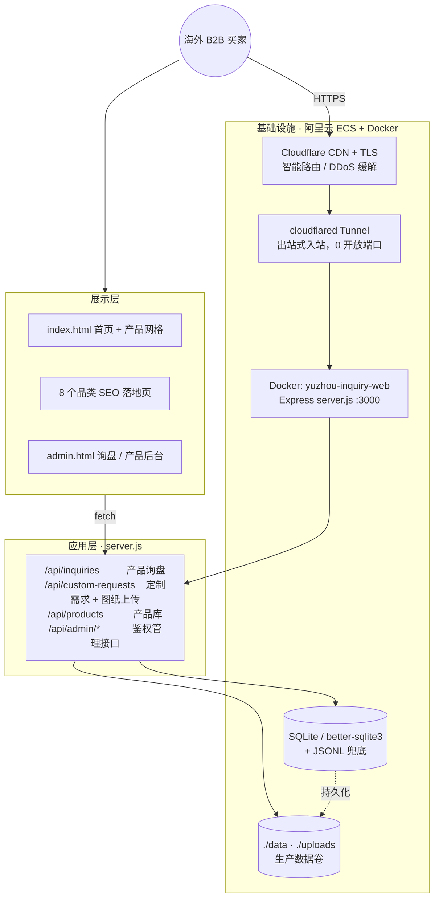
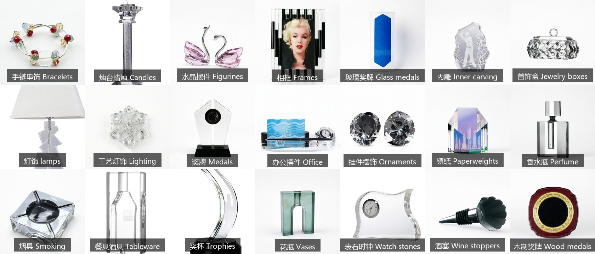
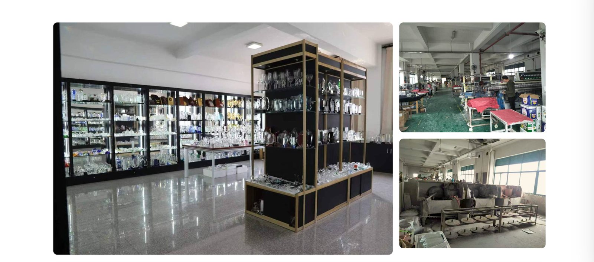
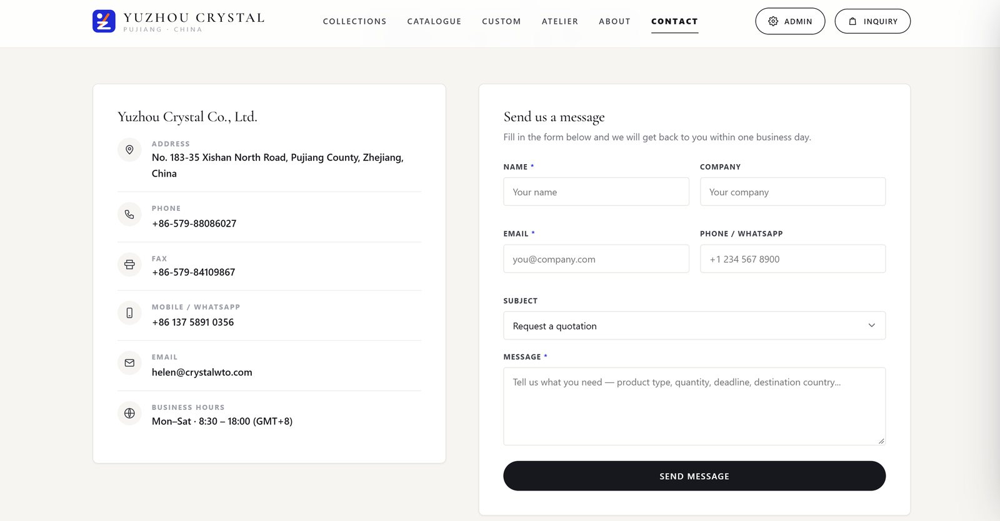
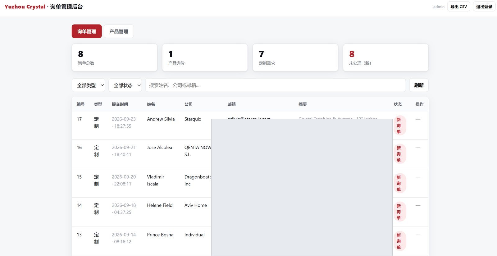
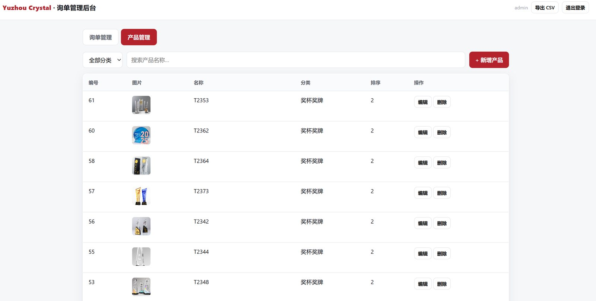
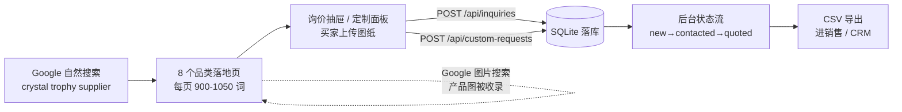

<div align="center">

<h1 style="text-align:center;margin-bottom:2px">Yuzhou Crystal · 宇宙水晶</h1>
<p align="center"><strong>水晶制品外贸 B2B 询盘平台 —— 全栈工程</strong></p>

[](https://nodejs.org/)
[](https://expressjs.com/)
[](https://www.sqlite.org/)
[](https://www.docker.com/)
[](https://www.crystalwto.com/)

</div>

---

## 一句话说明

一个**完整全栈询盘平台**：
前端展示 + 后端接单 + 数据库落库 + 后台 CRM + SEO 自然获客，
并且这套系统**已经在真实域名上运行，并收下真实海外买家询盘**。

| | |
|---|---|
| **生产站点** | <https://www.crystalwto.com/> |
| **管理后台** | <https://www.crystalwto.com/admin.html> |
| **服务器** | 阿里云 ECS · Docker 容器化 · Cloudflare Tunnel 入站 |
| **当前在库产品** | **158 个 SKU**（生产库实测） |
| **SEO 落地页** | **16 条**（其中 8 个品类页，Google 已收录） |
| **真实询盘** | **8 条**（5 条定制需求 + 1 条产品询价，见 [05](#05-真实询盘成果与商用价值)） |

---

## 目录

- [01 真实在线：生产环境实况](#01-真实在线生产环境实况)
- [02 全栈架构：从浏览器到生产服务器](#02-全栈架构从浏览器到生产服务器)
- [03 前端：站点、产品库与落地页矩阵](#03-前端站点产品库与落地页矩阵)
- [04 后端：API、数据模型与存储](#04-后端api数据模型与存储)
- [05 真实询盘成果与商用价值](#05-真实询盘成果与商用价值)
- [06 SEO 工程与实测成果](#06-seo-工程与实测成果)
- [07 工程规范、质量与安全](#07-工程规范质量与安全)
- [08 快速开始与部署](#08-快速开始与部署)
- [09 目录结构](#09-目录结构)

---

## 01 真实在线：生产环境实况

> 顶部横幅即 https://www.crystalwto.com/ 首页 Hero 区实拍图（**生产环境线上截图，非设计稿**）。

| 项目 | 实测值 | 说明 |
|---|---|---|
| 域名 | `www.crystalwto.com` | 已接入 Cloudflare，全站 HTTPS |
| 应用 | `yuzhou-inquiry`（Docker 单容器） | `node:20-alpine`，非 root 运行 |
| 健康检查 | `GET /api/health` → `200` | compose `healthcheck` 每 30s 探测，异常自动重启 |
| 数据持久化 | `./data` → `/app/data` 挂载卷 | 询盘、产品、上传图**不会随容器重建丢失** |
| 静态资源 | 随镜像构建（`Dockerfile COPY . .`） | 发版即 `docker compose up -d --build` |
| 访问链路 | Browser → Cloudflare → Tunnel → ECS:3000 | 源站无需开放 3000 端口到公网 |
| 后台 | `/admin.html` | token 校验，已 `robots.txt` 屏蔽抓取 |

**为什么不用传统 Nginx + 域名解析**：ECS 无固定公网 IP 稳定性保证，改用 Cloudflare Tunnel 出站入站，
只需一条 `cloudflared` 隧道指向本机 `3000` 端口，**服务器不用开端口、不被扫描、证书由 Cloudflare 自动续期**。

---

## 02 全栈架构：从浏览器到生产服务器



**四层齐全，每层都有可验证的产出：**

| 层 | 承担的事 | 具体落地 |
|---|---|---|
| 展示层 | 买家用什么看到产品、怎么下单 | 首页单页站点（129 KB）、8 个品类落地页、产品总览页、5 个能力页、管理后台（32 KB） |
| 应用层 | 请求怎么接、数据怎么校验 | Express 4 单端口同源服务，8 个业务端点，写接口限流，输入长度与图片类型白名单 |
| 数据层 | 询盘、产品存哪 | better-sqlite3 主存；原生模块缺失时自动切 JSONL 兜底；`specs` 以 JSON 存可变参数 |
| 基础设施层 | 怎么跑起来、怎么不丢数据 | Dockerfile（多阶段缓存 + 非 root + VOLUME）、docker-compose（healthcheck + restart）、Cloudflare Tunnel |

**同源部署（Same-origin）**：前端、API、图片走同一个 origin，不需要配 CORS 与跨域 cookie；
若要做前后端分离，`CORS_ORIGIN` 环境变量 + `<meta name="api-base">` 即可切分。

---

## 03 前端：站点、产品库与落地页矩阵

### 3.1 首页与产品库（真实数据渲染）

首页 `public/index.html`（128 KB）由 JS 渲染：21 个产品类目卡片 + 产品网格 + 询价抽屉（含购物车）+ 定制需求面板，
产品数据来自 `GET /api/products` —— **页面上每一个产品卡都是生产库里的真实记录**。

### 3.2 21 个产品类目（全部实拍）



### 3.3 工厂实景（全部为厂区真实照片）



> 上图为厂区**实拍照片**（展厅样品柜、注塑车间产线、磨抛工位），非渲染图、非素材图。

### 3.4 页面矩阵（16 条可索引页面）

| 类型 | 页面 | 作用 |
|---|---|---|
| **首页** | `/` | 21 类目入口、产品网格、询价入口 |
| **品类落地页 ×8** | `crystal-trophies`（奖杯）<br>`crystal-vases`（花瓶）<br>`crystal-home-decor`（家居摆件）<br>`crystal-office-desk-gifts`（办公摆件）<br>`crystal-candle-holders`（烛台）<br>`crystal-photo-frames`（相框）<br>`crystal-tableware-barware`（餐具酒具）<br>`crystal-perfume-fashion`（香水瓶） | 承接品类搜索词，每页独立 Title / H1 / Description / canonical |
| **产品总览** | `/collections/` | 8 个品类聚合 + 4 道工艺说明 + 商业参数 + FAQ |
| **能力页 ×5** | `crystal-manufacturer`（厂家实力）<br>`crystal-laser-engraving`（激光刻字）<br>`custom-crystal-packaging`（定制包装）<br>`custom-crystal-products`（可定制范围）<br>`about` / `contact` | 承接"厂家 / 定制 / 刻字 / 包装"等采购决策词 |
| **后台** | `/admin.html` | 询盘管理、产品管理、CSV 导出 |

**8 个品类页的内容厚度（线上实测词数）：**

| 页面 | 词数 | 页面 | 词数 |
|---|---|---|---|
| crystal-trophies | 1048 | crystal-candle-holders | 942 |
| crystal-home-decor | 1015 | crystal-photo-frames | 946 |
| crystal-office-desk-gifts | 971 | crystal-tableware-barware | 937 |
| crystal-perfume-fashion | 962 | crystal-vases | 960 |

### 3.5 线上 Contact 页实拍



> 生产环境 <https://www.crystalwto.com/contact/> 的真实页面：左侧公司信息（地址 / 电话 / 传真 / 手机 / 邮箱 / 营业时间），
> 右侧询盘表单（姓名 / 公司 / 邮箱 / WhatsApp / 需求类型 / 留言），表单直连 `POST /api/inquiries` 落库。

---

## 04 后端：API、数据模型与存储

### 4.1 公开接口

| Method | Path | 用途 |
|---|---|---|
| `GET` | `/api/health` | 存活探测（容器 healthcheck 用） |
| `POST` | `/api/inquiries` | 产品询盘，JSON：`name / company / email / country / message / items[]` |
| `POST` | `/api/custom-requests` | 定制需求，`multipart/form-data`（含图纸图，≤ 8 MB） |
| `GET` | `/api/products` | 产品库（生产线上返回 **158 条**） |
| `GET` | `/api/products/:id/image` | 产品图 |
| `GET` | `/api/admin/*` | 需 `x-admin-token` |

### 4.2 管理接口（token 鉴权）

| Method | Path | 说明 |
|---|---|---|
| `POST` | `/api/admin/login` / `logout` | 会话登录 |
| `GET` | `/api/admin/inquiries` | 分页 / 按类型 / 按状态 / 关键词搜索 |
| `GET` | `/api/admin/inquiries/stats` | 统计（总数 / 产品 / 定制 / 未处理） |
| `GET` | `/api/admin/inquiry/:id` | 单条详情（含产品项或定制规格 + 图纸） |
| `PATCH` | `/api/admin/inquiry/:id/status` | 状态流 `new → contacted → quoted → done / archived` |
| `GET` | `/api/admin/export.csv` | 带 BOM 的 CSV，可直接进 Excel / CRM |

### 4.3 数据模型

| 表 | 关键字段 |
|---|---|
| `inquiries` | `type`（product / custom）、`name`、`company`、`email`、`country`、`message`、`status`、`created_at` |
| `inquiry_items` | 关联询盘 + `product_id` / `name` / `qty`（产品询盘的明细行） |
| `custom_requests` | 定制规格 `specs`（JSON）+ `image_url`（买家上传图纸） |
| `products` | `name`、`category`、`description`、`specs`（JSON：材质 / 尺寸 / MOQ …）、`image`、`sort_order` |

**容错设计**：主存 `better-sqlite3`；若环境装不上原生模块，存储层**自动降级到 JSONL 文件**，
保证"即使数据库依赖缺失，询盘也不会丢"——这套降级在生产容器里被 `yuzhou-inquiry` 镜像验证过。

---

## 05 真实询盘成果与商用价值

### 5.1 生产后台实况（真实数据截图）



> 上图为管理后台「询单管理」页实拍：**询单总数 8 · 产品询价 1 · 定制需求 7 · 未处理 8**，
> 列表里是可点开的完整记录（提交时间、姓名、公司、需求摘要、状态）。
> 截图中的**客户邮箱列已做脱敏遮挡**，上传本仓库前均会重新打码。

### 5.2 产品管理后台实拍（后台直接改商品，不用动代码）



> 上图为后台「产品管理」页实拍：编号 / 图片 / 名称（型号）/ 分类 / 排序 / 编辑 / 删除一应俱全，
> 新增或修改走同一套 `/api/admin/*` 接口，前端首页与产品 API **立刻读到新数据，不需要改 HTML、不需要重新部署**。
> 生产库当前 21 个类目、158 个 SKU 全部在此维护。

**真实记录示例（生产库，截图可见）：**

| # | 时间 | 联系人 | 公司 / 买家 | 需求摘要 |
|---|---|---|---|---|
| 17 | 2026-09-23 | Andrew Silvia | Starquix | 水晶奖杯 12 英寸高 · 50–2026-12-12 |
| 16 | 2026-09-21 | Jose Alcolea | QENTA NOVA S.L. | 水晶奖杯 16–18 cm 直径 · 开放定制 |
| 15 | 2026-09-20 | Vladimir Istscala | Dragonboatpei Inc. | 无铅水晶奖杯 10×6.5 英寸 |
| 14 | 2026-09-18 | Helene Field | Aviv Home | 家居摆件 3.5″ 高 · 50–100 件刻字，询报价 |
| 13 | 2026-09-14 | Prince Bosa | Individual | 水晶奖杯 20 cm |

### 5.3 从"留邮箱"到"收订单线索"的转化链路



### 5.4 这套系统的商用价值在哪

| 维度 | 价值 | 依据 |
|---|---|---|
| **获客成本** | 一次建站，长期吃自然搜索流量；不依赖平台抽佣 | 全部自托管、零插件费用；GSC 实测数据见 06 章 |
| **线索质量** | 来的都是有明确规格（尺寸、数量、刻字要求）的采购方，不是随便来问价的散客 | 生产库 8 条里 7 条是**定制需求**，含具体 SKU 与件数 |
| **客户画像** | 欧美 B2B 买家：礼品公司、奖项定制商、酒店家居采购、分销商 | 询盘来源公司见 5.1 截图 |
| **长尾覆盖** | 8 个品类 × 158 SKU，覆盖 "trophy / vase / candle holder / photo frame / perfume bottle" 等采购词 | 落地页 + 产品库双轨 |
| **销售闭环** | 询盘 → 状态流转 → CSV → 跟进，不靠公共邮箱，不怕丢件 | 后台已跑通，邮件可选开启 |
| **资产可复用** | 技术栈通用（Node + Express + SQLite + Docker），换品类换文案即可复制 | 整套代码与部署脚本在本仓库 |

**一句话给结论**：这个项目的商业价值不在"有个官网"，而在
**「搜索引擎能找到 → 找到就能留需求 → 留下来进自己的库」这条链真正跑通了**，
而且是用真实询盘验证过的——不是 Demo。

---

## 06 SEO 工程与实测成果

### 6.1 做了什么（全是自托管，不靠第三方插件）

| 项 | 落地 | 文件 |
|---|---|---|
| 抓取规则 | `Allow: /`，屏蔽 `Disallow: /admin`、`/api`（后台与非网页资源不被吃抓取预算） | `public/robots.txt` |
| 索引清单 | 16 条 URL，含首页 + 8 品类 + 总览 + 5 能力页 | `public/sitemap.xml` |
| 结构化数据 | JSON-LD `@graph`：`Organization` + `WebSite` | `public/seo-schema.js` |
| 页面级 SEO | 16 页各自独立 Title、单一 H1、独立 Meta Description、self-canonical | 各页 `<head>` |
| 内容工程 | 8 个品类页各 ~950–1050 英文词 + 6 条 FAQ（可折叠展开） | 各品类 `index.html` |
| 内链结构 | 品类页 ↔ `/collections/` ↔ 首页 三点互链，品类页首部即放 "Browse all collections" | 各页 `.seo-links` |
| 收录诊断 | 用 Google Search Console 逐 URL 核对状态、排查 404 与重复内容 | — |

### 6.2 实测成果（Google Search Console，2026-10-08 报表）

| 指标 | 实测 |
|---|---|
| 已编入索引的页面 | **18** |
| 8 个品类落地页 | **全部已编入索引** |
| 站点地图 | `sitemap.xml` 16 条，已被 GSC 成功接收 |
| 已抓取但尚未索引 | 集中在 `/api/products/*/image`（历史遗留的产品图接口，已由 `Disallow: /api` 阻断新增） |
| 404 | 1 条（Cloudflare 邮箱保护端点 `/cdn-cgi/email-protection`，属外部链路噪声） |

> **时间线**：2026-09-03 8 个品类落地页上线 → 09 月被 Google 发现并开始抓取 →
> 10-07 内容扩容（每页 200 词 → ~950 词）+ 重写 `robots.txt` → 10-08 GSC 显示品类页已全部收录。

### 6.3 仍在推进（为避免误导，如实标注）

- 品类页之间内容相似度偏高（正文用词重叠约 0.34–0.42），已产出差异化改造方案，**待业务确认后上线**
- `/api` 产品图地址尚未切换到静态 `/uploads/`，切换后可进 Google 图片搜索（利好"以图找款"）
- GSC 侧尚未提交 sitemap 的最终复核与外链引流（行业目录 / B2B 平台档案）

---

## 07 工程规范、质量与安全

| 关注点 | 做法 |
|---|---|
| 生产安全 | 写接口按 IP 限流；图片 8 MB 上限 + 类型白名单；输入长度上限；安全响应头 |
| 后台鉴权 | `ADMIN_TOKEN` token 校验（header 或 query），未授权 401 |
| 容器安全 | `node:20-alpine`、**非 root 用户运行**、只暴露 3000 |
| 可靠性 | compose `restart: unless-stopped` + `healthcheck`；数据 `/app/data` 卷持久化 |
| 降级 | 数据库原生模块不可用时自动 JSONL 兜底，功能不中断 |
| 可观测 | `/api/health` + 后台统计卡（总数 / 询价 / 定制 / 未处理） |
| 本地开发 | `npm run dev` 自重启；`ADMIN_TOKEN` 未设置时启动打印随机 token |
| 文档 | 本 README（项目页）+ `DEPLOY_GUIDE.md` / `ALIYUN_DEPLOY_GUIDE.md` / `MIGRATION_GUIDE.md` / `PRODUCT_MANAGEMENT.md` |

---

## 08 快速开始与部署

### 本地运行

```bash
npm install
cp .env.example .env        # 务必设置 ADMIN_TOKEN
npm run dev                 # 或 node server.js
```

- 站点：`http://localhost:3000/`
- 后台：`http://localhost:3000/admin.html`
- 数据：`./data/inquiries.db`（SQLite）、`./uploads/`（图纸）

### Linux 生产部署（Docker Compose）

```bash
cp .env.example .env
# 修改 ADMIN_TOKEN / DOMAIN
docker compose up -d --build      # 静态资源烤进镜像，必须带 --build
docker compose ps                 # 看 yuzhou-inquiry 是否为 Up (healthy)
```

> 只 `docker restart` **不生效**——`public/` 是在镜像构建阶段 `COPY` 进去的。

### PM2 / systemd（无容器的 VPS）

```bash
npm install --omit=dev
pm2 start ecosystem.config.cjs && pm2 save
```

### PaaS（Railway / Render / Fly）

构建 `npm install`，启动 `node server.js`，环境里设 `PORT` / `ADMIN_TOKEN`，
并为 `./data`、`./uploads` 挂持久卷，否则询盘会随部署清空。

---

## 09 目录结构

```
yuzhou-crystal/
├── server.js                  # Express 应用（551 行，8 个业务端点）
├── package.json               # 依赖与脚本（better-sqlite3 / express / multer / cors / nodemailer）
├── Dockerfile                 # node:20-alpine，非 root，VOLUME 持久化
├── docker-compose.yml         # web 服务 + healthcheck + restart 策略
├── ecosystem.config.cjs       # PM2 启动配置
├── src/
│   ├── store.js               # 存储抽象层（SQLite 主 / JSONL 兜底）
│   ├── mailer.js              # 可选 SMTP 通知
│   └── dotenv.js              # 环境变量加载
├── public/                    # 全站前端
│   ├── index.html             # 首页（129 KB，JS 渲染产品网格与询价抽屉）
│   ├── admin.html             # 询盘 / 产品后台（32 KB）
│   ├── robots.txt             # 抓取规则
│   ├── sitemap.xml            # 16 条索引清单
│   ├── seo.css / seo-category.js / seo-schema.js / inquiry-cart.js
│   ├── images/{factory,about,products}
│   └── <16 个页面目录>        # 8 品类落地页 + 总览 + 5 能力页 + 404
├── docs/
│   └── screens/               # 本项目页使用的真实站点截图
├── scripts/          运维与备份脚本
tools/            数据处理小工具
deploy/           批量部署与重建脚本
└── 部署文档：DEPLOY_GUIDE.md / ALIYUN_DEPLOY_GUIDE.md / PRODUCT_MANAGEMENT.md / MIGRATION_GUIDE.md
```

---

## 附：本项目与"普通官网"的区别

| | 普通外贸官网 | 本项目 |
|---|---|---|
| 客户留资 | 留邮箱，人工收件 | POST 落库 + 后台 CRM + 状态流转 + CSV |
| 图纸定制 | 邮件附件，容易丢 | 上传接口 + 落盘 + 后台可查看 |
| 流量来源 | 主要靠阿里国际站 / 展会 | 自有站点吃 Google 自然搜索（16 页落地页） |
| 产品维护 | 改 HTML | 后台产品管理 + 产品 API |
| 部署 | ftp 丢文件 | Docker 镜像版本化，回滚即换 tag |
| 数据 | 散在邮箱 | SQLite 结构化，可统计可导出 |

---

**技术栈**：Node.js 20 · Express 4 · better-sqlite3 · multer · cors · nodemailer（可选） · Docker · Cloudflare Tunnel · 阿里云 ECS
